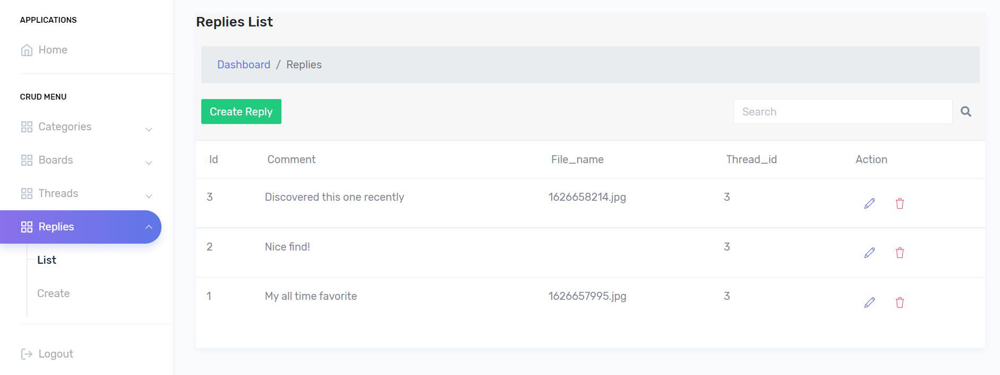
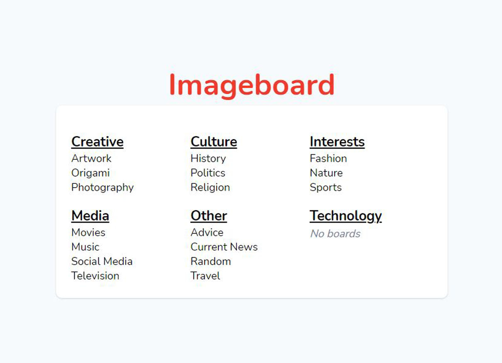
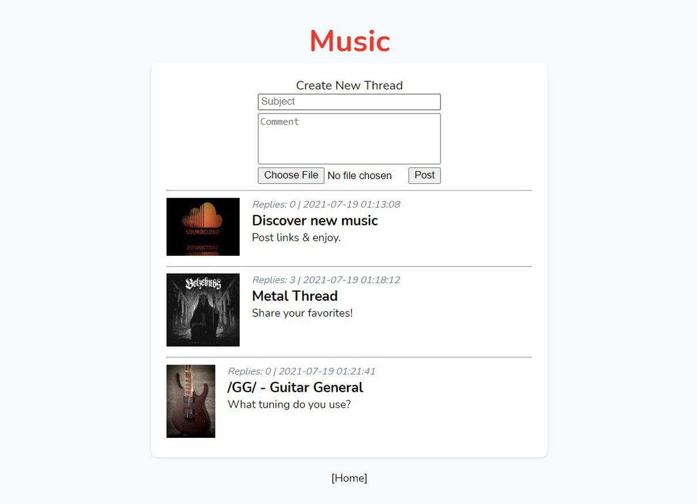
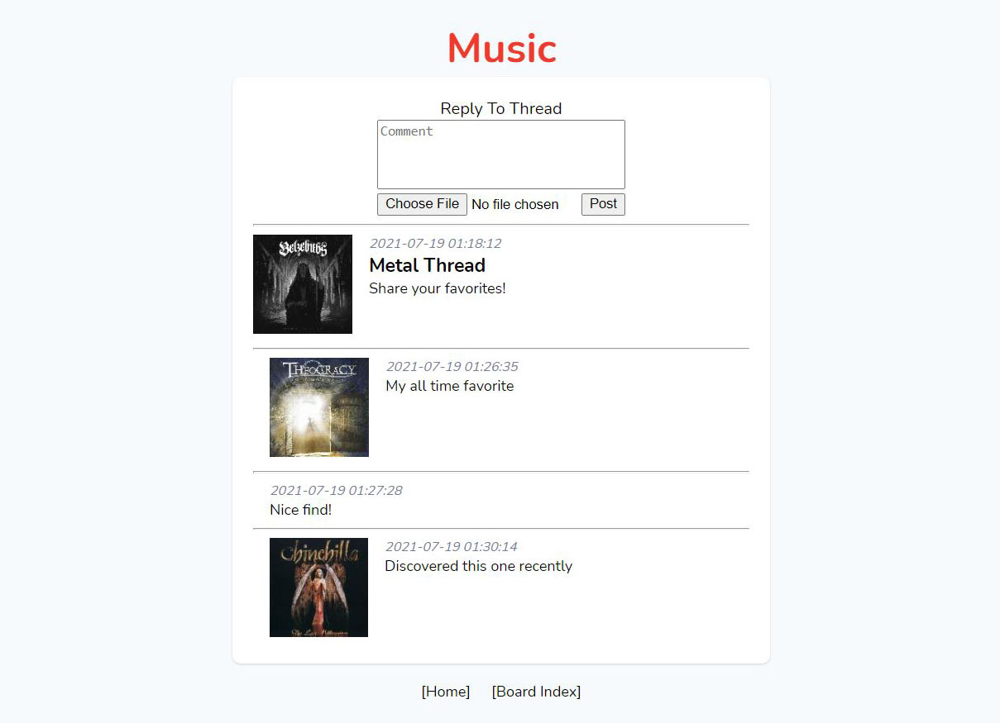

# Laravel Imageboard
An imageboard-type website built with Laravel.
Users can anonymously create threads and reply to other people's threads, upload images, and browse categories.
Heavily inspired by other popular imageboards.

## Features
* Admin panel for creating, editing, and deleting entries
* Admin databse seeding
* Image uploading and thumbnail creation for fast page loads
* Simple and appealing UI

## Screenshots

## Credits
[Laravel Easypanel](https://github.com/rezaamini-ir/laravel-easypanel)

## License
[MIT license](LICENSE.txt)
